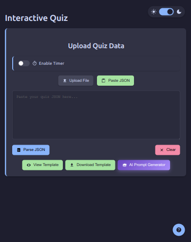
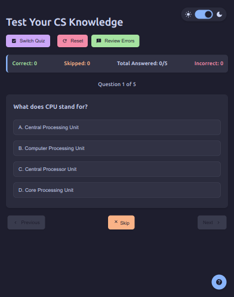

# Interactive Quiz App

A versatile, feature-rich web application for creating and taking interactive quizzes on any topic, with powerful learning tools and a customizable interface.

🎉 **Try the Live Demo Now!**: [Interactive Quiz App](https://joyontasaha.github.io/interactive-quiz-app/) 🚀

## App Screenshots

### Home Screen


### Quiz Interface


## Features

### Quiz Creation and Management
- **Multiple Import Methods**: Upload JSON quiz files or paste quiz data directly
- **AI-Powered Quiz Generation**: Create custom prompts for AI services to generate quizzes
- **Sample Quiz Template**: View, copy, or download the quiz format template
- **JSON Validation**: Built-in validation ensures quiz data meets required format

### Quiz Interface
- **Intuitive Navigation**: Move between questions with previous/next buttons
- **Progress Tracking**: See your current position and overall progress
- **Comprehensive Scoring**: Track correct, incorrect, and skipped answers
- **Detailed Feedback**: Get explanations for both correct and incorrect answers
- **Answer Highlighting**: Visual indicators for correct/incorrect selections
- **Question History**: Navigate freely between all attempted questions

### Learning Tools
- **Retry Questions**: Option to try again on incorrectly answered questions
- **Skip Questions**: Skip difficult questions and return to them later
- **Review Errors**: Focus specifically on questions answered incorrectly
- **Reset Quiz**: Start over with a fresh attempt at any time
- **Quiz Switching**: Change to a different quiz without refreshing the page
- **Interactive Tutorial**: Step-by-step guide explaining all app features

### Customization Options
- **Timer Mode**: Set time limits for quiz sessions with customizable durations
- **Dark/Light Themes**: Choose between light and dark visual modes
- **Responsive Design**: Works on desktop, tablet, and mobile devices
- **Multiple Duration Options**: Select from various time limits for timed quizzes
- **Accessibility Features**: High contrast options and readable font sizes

### Performance Analysis
- **Completion Summary**: Detailed statistics after quiz completion
- **Performance Feedback**: Personalized messages based on quiz performance
- **Visual Celebration**: Animated fireworks display for completed quizzes
- **Score Breakdown**: Clear visualization of correct, incorrect, and skipped questions
- **Performance Rating**: Contextual feedback based on your score percentage

## Quiz Format

The app uses a specific JSON format for quizzes:

```json
{
  "title": "Quiz Title",
  "heading": "Quiz Heading Shown on Page",
  "questions": [
    {
      "question": "Question text goes here?",
      "options": [
        "A. First option",
        "B. Second option",
        "C. Third option",
        "D. Fourth option"
      ],
      "correctAnswer": "A",
      "explanation": "Explanation of why A is correct and other options are incorrect."
    }
    // Additional questions follow the same format
  ]
}
```

## AI Prompt Generation

The app includes a feature to generate prompts for AI services like ChatGPT that will produce quizzes in the correct format. 

To use this feature:
1. Click "AI Prompt Generator"
2. Enter your topic or paste specific content
3. Select the number of questions
4. Click "Generate Prompt" 
5. Copy the generated prompt
6. Paste it into your AI service
7. Copy the AI's response back into the app

## Getting Started

1. **Clone the Repository**:  
  ```bash
  git clone https://github.com/JoyontaSaha/interactive-quiz-app.git
  ```
2. **Navigate to the Project Directory**:  
  ```bash
  cd interactive-quiz-app
  ```
3. **Open the Application**:  
  Open `index.html` in any modern web browser to launch the app.
4. **Explore the Features**:  
  - Start with the provided sample quiz or import your own quiz data.
  - Follow the interactive tutorial for a step-by-step walkthrough of the app's features.

Enjoy creating and taking quizzes with the Interactive Quiz App!

## Browser Compatibility

The app is compatible with all modern browsers:
- Chrome (recommended)
- Firefox
- Safari
- Edge

## Contributing

Contributions are welcome! Feel free to submit issues or pull requests for new features or bug fixes.

## License

Free for all to use.

